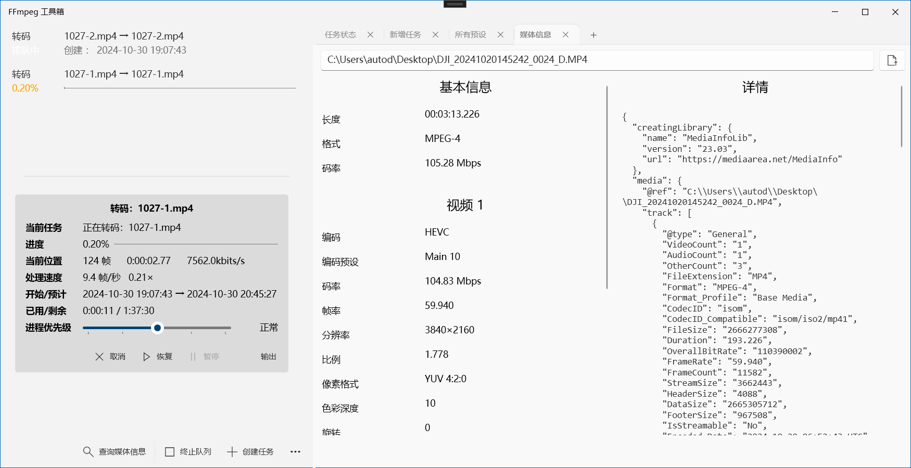

# FFmpeg GUI

使用 Vue.js + ASP.NET + WPF 搭建的 FFmpeg 的 Web/Windows GUI 程序，支持视频转码、拼接等功能

## 架构

| 项目名 | 项目名（中文） | 介绍                                                                                      |
| ------ | -------------- | ----------------------------------------------------------------------------------------- |
| Core   | 核心           | 提供Host和WPF、Web的契约以及公共方法                                                      |
| Host   | 主机           | 通过NamedPipe向WebAPI发布服务                                                             |
| WebAPI | 服务端         | 使用ASP.NetCore实现的服务器                                                               |
| Web    | Web客户端      | 使用Vue.js实现的网页端                                                                    |
| WPF    | 桌面GUI        | 桌面端的GUI实现                                                                           |
| WebApp | 桌面客户端     | 对WebAPI、Web和Host进行包装的、使用内置浏览器显示的、基于WinForms的桌面客户端（不再使用） |


## 截图

### 网页版


### WPF桌面版




## 构建与部署

### 准备工作

1. 确保安装了 .NET 8 SDK：
2. 确保安装了npm（Node.js）：
3. 确保在根目录下（与ReadMe同级目录）的 `bin`目录中放置了ffmpeg二进制文件（shared版）：[下载](https://www.ffmpeg.org/download.html) 。共有三个exe文件和若干个dll文件。已测试版本：6.1.1
4. 若要使用媒体信息查询功能，应在根目录（与ReadMe同级目录）下的 `bin`目录中放置了MediaInfo CLI可执行文件（如`MediaInfo.exe`）：[下载](https://mediaarea.net/en/MediaInfo/Download)
5. 若要使用编码测试功能，应在根目录（与ReadMe同级目录）下的 `bin`目录中放置了测试视频 `test.mp4`和VMAF模型（[下载](https://github.com/Netflix/vmaf/blob/master/model/vmaf_v0.6.1.json)。选取的视频宜为4K分辨率，30秒以上的长度。

### 自动构建

执行PowerShell：`./build.ps1`。

参数：

- -w：生成Web（Web、WebAPI、Host）
- -d：生成WPF（标准、单文件、自包含）

若提示`无法加载文件 ******.ps1，因为在此系统中禁止执行脚本`，需要首先在管理员模式下运行PowerShell并执行 `set-executionpolicy remotesigned`，然后按Y确认。
生成文件位于 `Generation/Publish`下，其中 `WebPackage`为Web部署包，`WPF`为桌面程序。

### 部署基于Windows +IIS的Web版本

1. 进入 `Generation/Publish/WebPackage`
2. 编辑 `api`的 `appsettings.json`，主要修改 `InputDir`和 `OutputDir`项，指定输入和输出目录。其它修改项详见文件内的注释。
3. 在合适的位置新建一个网站文件夹，将 `Generation/Publish/WebPackage`内的所有内容复制到新建的文件夹之中。
4. 确保安装了DotNET 8 Hosting Bundle，并在Windows中启用了IIS。
5. 在IIS中新建网站，指定物理目录为之前新建的目录。右键其中的api目录，设置为虚拟应用程序。
6. 运行Host的exe，然后打开设置的url即可使用。

- 若要在IIS中启用自动启动Host功能，还需要：

  1. IIS > 应用程序池。
  2. 为网站选择高级设置。
  3. 将标识（Identity）更改为 LocalSystem。
  4. 重启 IIS。
- 若输入或输出文件夹位于网络位置等IIS无权限的位置，则需要：

  1. 设置 `appsettings.json`中的 `InputDirAccessable`和/或 `OutputDirAccessable`为 `false`，告知程序无权限访问，那么后端将通过Host对文件进行访问。
  2. 关闭通过WebAPI自动启动Host功能，因为自动启动的Host将继承IIS的权限，依旧无法访问。
  3. 这种模式下，HTTP上传和下载功能将不可用（懒得写）。
- Host启动参数：

  ```
  -s           (默认： false) 注册开机启动
  -u           (默认： false) 取消开机启动
  -d           (默认： false) 设置工作目录为程序所在目录
  --help       显示帮助信息
  ```

## 开发

### 项目结构

- Core：提供Host和WPF、Web的契约以及公共方法
  - Model：数据库实体和相关非结构化数据模型
  - Dto：用于API与Host交换、前后端交换的数据结构
  - FFMpegArgumentExtension：用于FFMpegCore库上的一些扩展参数
  - Manager：对数据和服务的管理
  - IPipeService：API与Host之间通信的管道契约
  - Logger：日志管理
  - MediaInfoModule：调用MediaInfo.dll
- Host：通过NamedPipe向WebAPI发布服务
  - ConsoleLogger：命令行的Logger
  - FtpManager：FTP相关操作
  - PipeService：对IPipeService的实现，向WebAPI提供服务
- WebAPI：使用ASP.NetCore实现的服务器
  - Controllers：控制器，提供Web接口
  - Converter：使用JSON序列化数据时用到的转换器
  - Dto：与前端交换数据时用到的数据结构
  - PipeClient：用于调用Host发布的服务
  - TokenFilter：在处理请求之前进行拦截，验证是否带有正确的Token
- Web：使用Vue.js实现的网页端
  - public：静态文件
  - src：Web源码，使用WebPack打包
    - assets：静态资源
    - components：Vue组件
    - router：路由设置
    - views：Vue视图
      - Add：新增任务视图
    - common.ts：一些通用方法
    - main.ts：启动文件
    - net.ts：网络相关（Vue.axios）代码
    - parameters.ts：一些固定参数
- WPF：桌面端的GUI实现
  - Model：桌面GUI中用到的一些数据结构
  - Pages：在主界面右侧显示的页面
  - Panels：组成页面或窗口的、具有比较单一的功能的面板
  - MainWindow：主窗口
  - TestWindow：编码性能测试窗口

### 注意事项

- Clone仓库后，只需安装好相关SDK，即可进行构建，无需额外设置。
- `libs`目录中二进制文件来自于：[FzLib](https://github.com/autodotua/FzLib)和[Wpf.Notifications](https://github.com/autodotua/Wpf.Notifications)，均为开源产品。
- 开发者对WPF比较了解，对ASP.NET略有涉猎，但对前端技术技艺不精，因此网页端做得比较简单。欢迎大家在此基础上进行二次开发。
