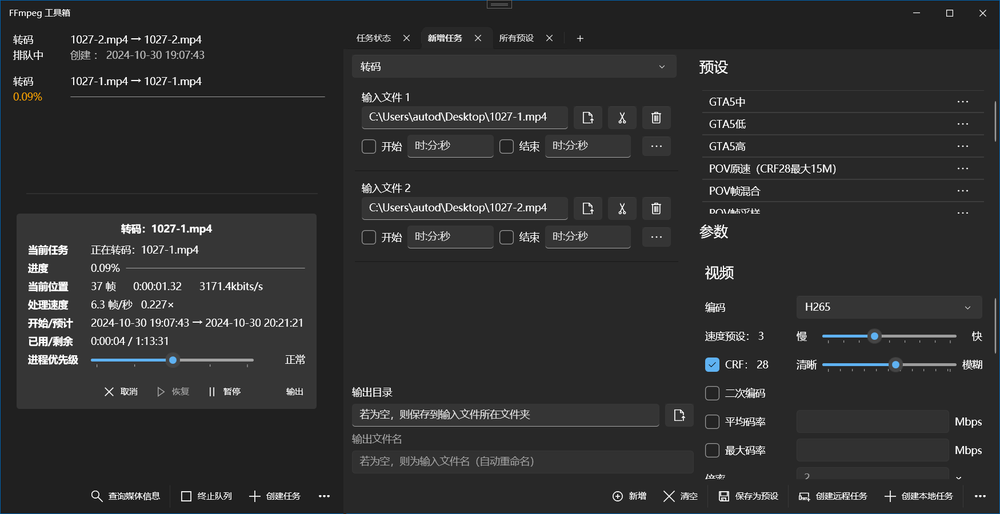

# FFmpeg GUI

## 截图

### 网页版

### WPF桌面版

## 架构

|项目名|项目名（中文）|介绍|
|-|-|-|
|Core|核心|提供Host和WPF、Web的契约以及公共方法|
|Host|主机|对FFmpeg进行包装，实现其功能，并通过NamedPipe进行发布|
|WebAPI|服务端|使用ASP.NetCore实现的服务器|
|Web|Web客户端|使用Vue.js实现的网页端|
|WPF|桌面GUI|桌面端的GUI实现|
|WebApp|桌面客户端|对WebAPI、Web和Host进行包装的、使用内置浏览器显示的、基于WinForms的桌面客户端（不再使用）|

## 构建与部署

### 自动构建

1. 确保已安装.NET 6 SDK和npm，并且npm包已经还原。
2. 执行PowerShell：`./build.ps1`。生成文件位于`Generation/Publish`下，其中`WebPackage`为Web部署包，`WPF`为桌面程序。
3. 将ffmpeg和MediaInfo相关二进制文件放到`Generation/Publish/WPF`和`Generation/Publish/WebPackage/host`中。
4. 部署到IIS中，相关要求参见下方。

### 基于Windows +IIS的Web版本部署

1. 在VS中发布Host和WebAPI，在Web项目中命令行运行`npm run build`发布前端包
2. 将ffmpeg二进制文件和MediaInfo.dll二进制文件放到Host生成的文件夹中。ffmpeg的二进制文件可以使用static包，必须包含ffmpeg.exe和ffpobe.exe；也可以使用shared包。
3. 修改WebAPI的`appsettings.json`，主要修改`InputDir`和`OutputDir`项，指定输入和输出目录
4. 新建一个网站文件夹，放置前端文件，新建api文件夹放置WebAPI文件，新建Host文件夹放置Host文件
4. 确保安装了.Net 6 Hosting Bundle，并在Windows中启用了IIS
4. 在IIS中新建网站，指定物理目录为之前新建的目录，设置api为虚拟应用程序
7. 运行Host的exe，然后打开设置的url即可使用

- 若要在IIS中启用自动启动Host功能，还需要：
    1. IIS > 应用程序池
    2. 为网站选择高级设置
    3. 将标识（Identity）更改为 LocalSystem
    4. 重启 IIS

- 若输入或输出文件夹位于网络位置等IIS无权限的位置，则需要：
    - 设置`appsettings.json`中的 `InputDirAccessable`和/或`OutputDirAccessable`为`false`，告知程序无权限访问，那么后端将通过Host对文件进行访问
    - 关闭自动启动Host功能，因为自动启动的Host将继承IIS的权限，依旧无法访问
    - 这种模式下，HTTP上传和下载功能将不可用（懒得写）

### 桌面包装版本部署（过时）

1. 在VS中发布或生成WebApp，在Web项目中命令行运行`npm run build`发布前端包
2. 将前端包放入WebApp生成或发布的文件夹中：
   - 方式1：运行一次WebApp的程序，即可自动复制
   - 方式2：将Web项目中的dist文件夹复制到WebApp程序目录并改名为html
3. 将ffmpeg二进制文件和MediaInfo.dll二进制文件放到Host生成的文件夹中。ffmpeg的二进制文件可以使用static包，必须包含ffmpeg.exe和ffpobe.exe；也可以使用shared包。

### 桌面WPF版本部署

1. 在VS中生成WPF版（Release）
2. 将ffmpeg二进制文件和MediaInfo.dll二进制文件放到Host生成的文件夹（net5.0-windows10.0.18362.0）中。ffmpeg的二进制文件必须使用shared包，需要将3个exe文件和其他所有dll文件放入生成的文件夹中